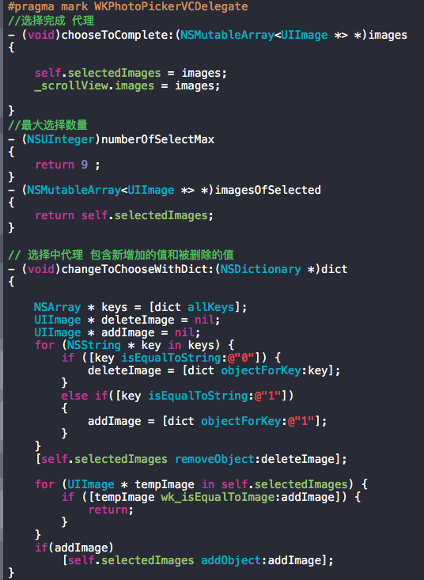
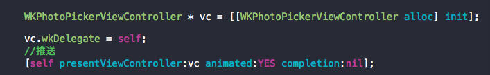
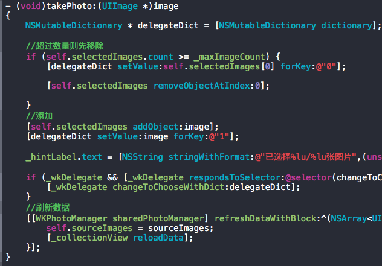
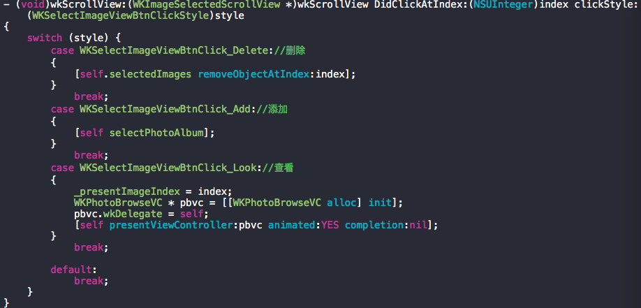
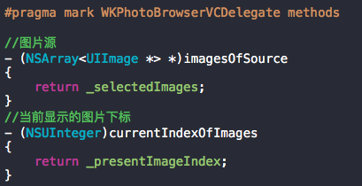
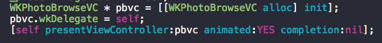

#WKPhotoPickerDemo详解

###优势——集成了四大功能
	1. 相册多选
	2. 水印相机
	3. 图片多张排列
	4. 图片浏览（只支持本地）

###效果图

`暂缺`

####一、相册多选（内置水印相机）

**相关类：**

	WKPhotoPickerViewController 主体类-控制器
	WKPhotoCollectionViewCell   展示类—cell
	WKPhotoManager				 数据获取类-相册管理器
	UIImage+WKAssetID			 数据唯一标识拓展-图片拓展
    
**相关功能：**
	
	1. 分相册查看，跨相册选择图片
	2. 可设置选择图片最大数量（默认九张）
	3. 内置拍照（水印相机和系统相机两种模式）
	4. 绝不会出现选择同一张图片的情况（使用了系统内置的AssetID作为唯一标识符）
	
**使用方式**

#####1. 引入头文件并遵守代理协议

#####2. 实现协议方法

#####3. 新建图片多选VC并推入 

	
###二、水印相机

**相关类:**
	
	WKImagePickerController 主体类—控制器
	WKCameroCell			 水印——cell
	WKCaptureImageView		 拍照完成后View
	WKWatermarkCameraView   拍照以及水印选择View
	WKPhotoManager			 图片存放类-相册管理器
**相关功能**

	1. 系统相机拍照
	2. 水印相机拍照
	3. 水印可自添加水印拍照
	4. 拍照后可选择重拍，保存，以及立即使用照片
	
**使用方式**
	
#####1. 引入头文件并遵守代理协议

#####2. 实现协议方法

#####3. 根据所需模式创建VC并推入 

	
###三、图片多张排列

**相关类:**

	WKSelectImageView 			存放Image的view
	WKImageSelectedScrollView 	放imageview的滚动视图
**相关功能**
	
	1. 多张图片排列
	2. 通过点击图片可删除、查看、添加（在代理中返回不同状态）
**使用方式**

#####1. 引入头文件并遵守代理协议

#####2. 实现协议方法

#####3. 创建并使用 

###四、图片组浏览

**相关类:**
	
	WKPhotoBrowseVC  主体类 - 控制器
	WKNavView		  导航栏 
	
**相关功能**

	1. 图片浏览（可通过不同的点击，设置当前显示的图片）
	2. 翻页浏览    
	
**使用方式**

#####1. 引入头文件并遵守代理协议

#####2. 实现协议方法

#####3. 创建并推入

